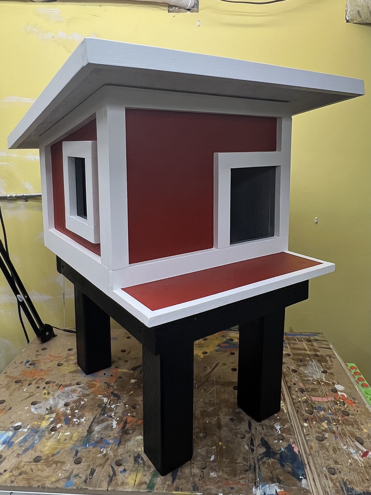
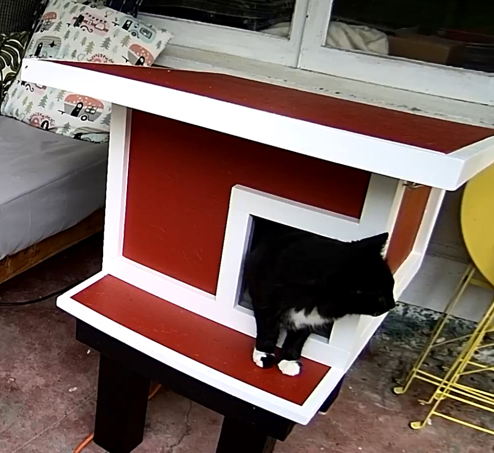
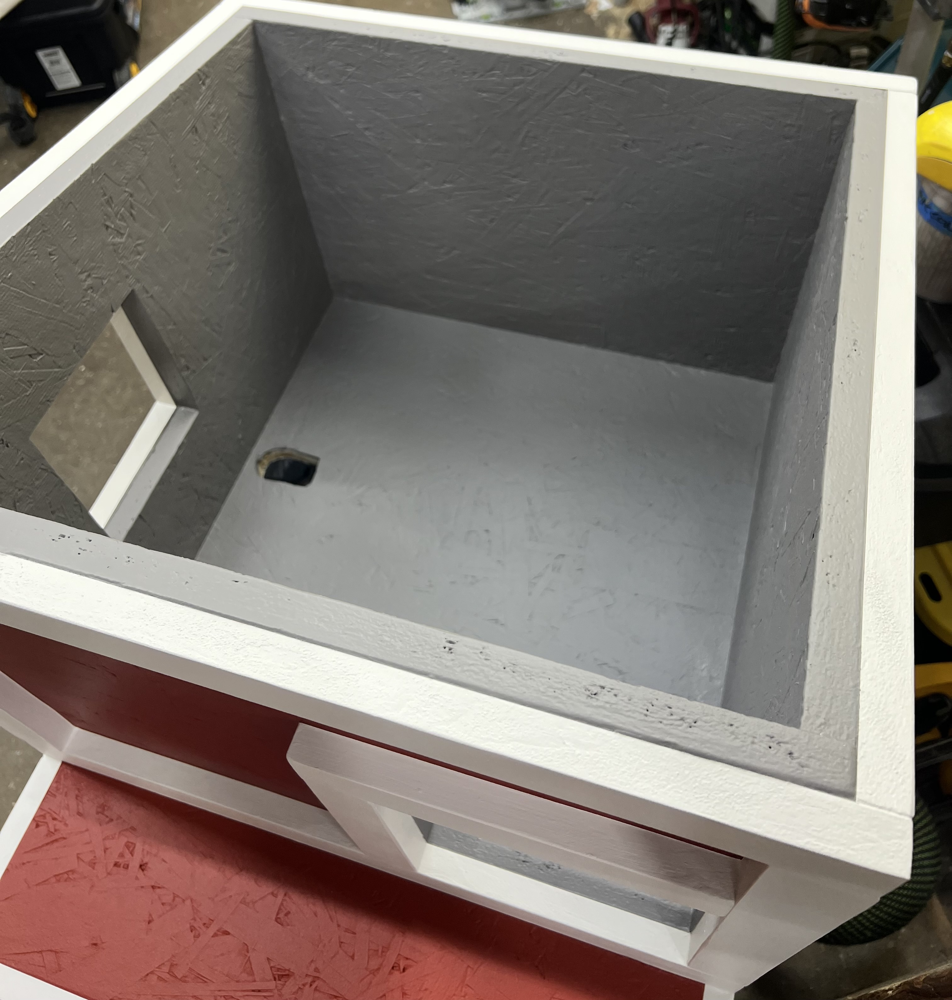

# Domino's House

Plans for Domino's house has been a frequent request, so I'm providing whatever info I can here, free of charge. While these are not full step-by-step instructions, any woodworker of at least intermediate level should be able to look at the provided pictures, diagrams and text and build something similar.

## Criteria & Resources 

Before making my plans, I researched a lot of literature about feral cat shelters. Based on that research, I wanted to incorporate the following elements:
* Elevated platform
* Two exits (provides an emergency exit in case of an intruder)
* Sloping roof (for rain runoff)
* Perch
* Hinged, openable roof for easy cleaning & repairs

We are in San Francisco, California, where temperatures don't drop enough that insulation, door flaps or straw bedding would become necessary.

After completing the build, I came across an article called "[The Myth of the Emergency Exit](https://feralvilla-com.3dcartstores.com/The-Myth-of-the-Emergency-Exit_ep_43.html)" on Feral Villa that questions the need for two exits. I think that this is something to potentially further think about, especially in cold climates where two exits will increase the challenge of keeping the inside of the house warm.

Alley Cat Allies has a [great list](https://www.alleycat.org/resources/feral-cat-shelter-options-gallery/) of various ready-made houses, as well as DIY plans out there. They list the pros and cons for each.

In particular, Domino's house most resembles the FIVER plans. Check out [their website](http://www.fivercats.com) for a very detailed plan as well as videos on how to build their version.

THe inside of the house is 18" x 18"; 16" high in the front and 13" high in the back. This size seems to work great for one cat.

## Materials

The house can be built from a single 4' x 8' sheet of 3/4 inch stock -- I used exterior grad OSB ($30 as of November 2023). If trim is added, then any 3/4" material can be used for that -- I used scrap "one-by" pine boards I had laying around. The elevated platform is constructed from pressure-treated 2x4s (for the apron) and 4x4s (for the legs), which I also used scrap for. If I'd buy the material new, I'd probably use 2x2s for the legs as well to make things a bit cheaper and easier to handle.

## Digital plans

I made my plans using the CAD software [SketchUp](https://www.sketchup.com). Users of SketchUp can [download the file](Feral Cat House.skp) to look at / modify in the computer. For everyone else, please see the detailed schematics in the [Views folder](Views).

There's also a [Cutlist.pdf](Cutlist.pdf) which shows how the panels are laid out on a 4' x 8' sheet (cut into three 32" sections which is how I usually handle sheetgoods in my small shop).

## Building tips

The main body is little more than a regular box that you can construct with the joinery method of your choice (I used biscuits & exterior wood glue). The slope of the roof is ~9 degrees, so set your blade to that angle to cut the tops of the front and back panels (and trim).

Trim generally is 1-1/2 in. wide, except at the bottom of the sides and back where it also covers the bottom panel (so is 2-1/4 in. wide). Trim is attached with glue + brad nails.

If the house is exposed to precipitation then I recommend weatherproofing the room. My original plan was to add a corrugated panel on top of the roof. Ultimately we decided to put the house in a sheltered area underneath an overhang so that became unnecessary for now.

After basic construction and before painting, I caulked all seams between the trim and the main body to maximize weatherproofing.

The platform held together by 2-1/2 in construction screws.

The house is attached to the platform using four simple L-brackets.

The roof hinges are attached at the back panel of the house, though this is a matter of taste, the hinges could be on any side.

I added 1/4 in weather stripping between the house and the roof.

## Inside the house

I use an [outdoor heated pad](https://a.co/d/8YKrEVJ) that's exactly 18 in wide, so fits perfectly. 

To fill the remaining 4 inches of space in front of the heated pad, I fitted [two small pillows](https://a.co/d/fkmR5th).

The camera I use is a [cheap Yi device](https://a.co/d/iy7VOdG), mounted on the inside wall using special-purpose [brackets](https://a.co/d/dUVt9Q1).

I drilled a hole in the bottom of the house to route the cables for heated pad and camera. The hole is under the heated pad which effectively seals it up.

