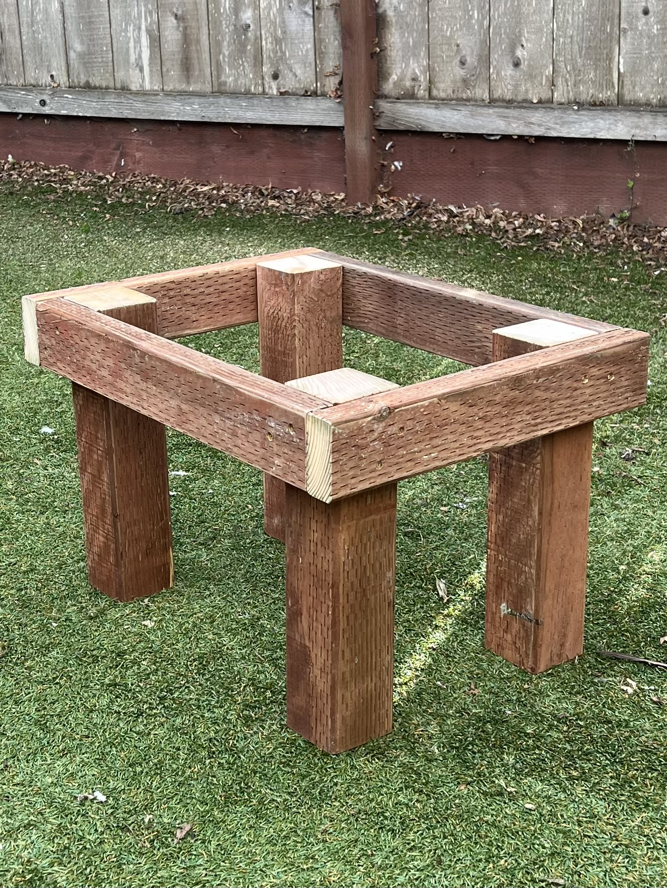
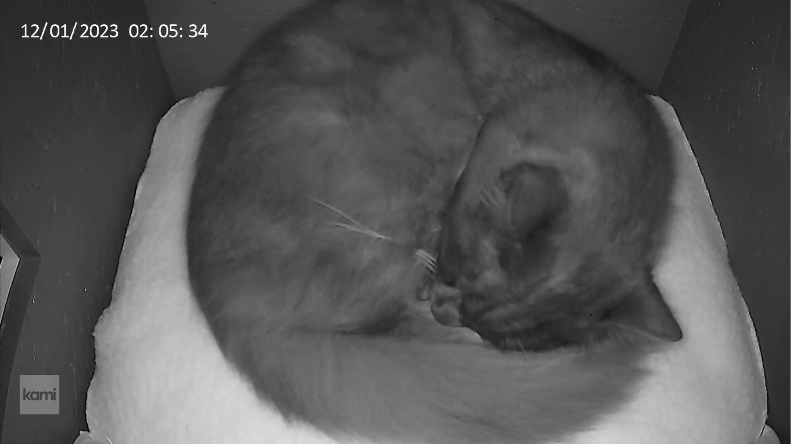

# Domino's House

Plans for Domino's house has been a frequent request, so I'm providing whatever info I can here, free of charge. While these are not full step-by-step instructions, any woodworker of some experience should be able to look at the provided pictures, diagrams and text and build something similar.

## Criteria & Resources 

Before making my plans, I read a lot of the literature on feral cat shelters. Based on that research, I wanted to incorporate the following elements:

* Elevated platform
* Two exits (provides an emergency exit in case of an intruder)
* Sloped roof (for rain runoff)
* Perch
* Hinged, openable roof for easy cleaning & repairs

We are in San Francisco, California, where temperatures don't drop enough that extra insulation, door flaps or straw bedding would become necessary.

After completing the build, I came across an article called "[The Myth of the Emergency Exit](https://feralvilla-com.3dcartstores.com/The-Myth-of-the-Emergency-Exit_ep_43.html)" on Feral Villa that questions the need for two exits in feral cat shelters. I think that this is something to potentially further think about and discuss, especially for cold climates where two exits will increase the challenge of keeping the inside of the house warm and draft-free. In our milder Northern California climate it seems to me Domino enjoys having the choice between two doors :)

Alley Cat Allies has a [great list](https://www.alleycat.org/resources/feral-cat-shelter-options-gallery/) of various ready-made houses, as well as available DIY plans out there. They list the pros and cons for each.

In particular, Domino's house most closely resembles the FIVER plans. Check out [their website](http://www.fivercats.com) for a very detailed plan as well as videos on how to build their version.

The inside of Domino's house is 18" x 18" and 16" high in the front / 13" high in the back. This size seems to work great for one cat.

## Materials

The house can be built from a single 4' x 8' sheet of 3/4 inch material -- I used exterior grade OSB ($30 as of November 2023). Any suitable 3/4" material can be used for the trim -- I used scrap "one-by" pine boards I had laying around. The elevated platform is constructed from pressure-treated 2x4s (for the apron) and 4x4s (for the legs), which I also used scrap for. If I'd buy the pressure-treated boards new, I'd probably use 2x2s for the legs as well to make things a bit cheaper and easier to handle.

## Digital plans

I made my plans using the CAD software [SketchUp](https://www.sketchup.com). Users of SketchUp can [download my file](FeralCatHouse.skp) to look at / modify on the computer. For everyone else, please see the detailed schematics & diagrams I provided in the [Views folder](Views).

There's also a [Cutlist.pdf](Cutlist.pdf) which shows how the panels can be optimally laid out on a 4' x 8' sheet (cut into three 32" sections) to minimize waste. I used [Cutlist Optimizer](https://www.cutlistoptimizer.com) to create the cutlist.

## Building tips

The main body is little more than a regular box that you can construct with the joinery method of your choice (I used my biscuit joiner & exterior wood glue). The slope of the roof is ~9 degrees, so set your blade to that angle to cut the tops of the front and back panels (and trim).

Trim generally is 1-1/2 in. wide, except at the bottom of the sides and back where it also covers the bottom panel (so is 2-1/4 in. wide). Trim is attached with glue + brad nails.

If the house is exposed to precipitation then I recommend weatherproofing the roof. My original plan was to add a corrugated panel on top of the roof. Ultimately we decided to put the house in a sheltered area underneath an overhang so that became unnecessary for now.

After basic construction and before painting, all seams between the trim and the main body were caulked to maximize weatherproofing.

The platform is held together by 2-1/2 in construction screws.

The house is attached to the platform using four simple L-brackets.

Note that I built the platform from pressure-treated lumber that has been hanging out in my shop's scrap pile for something like a year, ie. it was dry and ready to paint. When it comes from the store, pressure-treated lumber is usually very wet and not paintable without significant drying time. I'd have probably skipped painting the platform altogether had I not had dry pressure-treated lumber ready to go.

The roof hinges are attached at the back panel of the house, though this is a matter of taste, the hinges could be on any side.

Though the roof is heavy, I still think it could be blown open by strong wind gusts, so it needs to be secured in place on the side opposite of the hinges. I used two hook-and-eye latches on either corner of the house.

I also added 1/4 in. [weather stripping](https://a.co/d/60jw5ea) between the house and the roof for a better seal and bit of cushioning.

## Inside the house

I use an [outdoor heated pad](https://a.co/d/8YKrEVJ) that's exactly 18 in wide, so it fits perfectly. 

To fill the remaining 4 inches of floor space in front of the heated pad, I fitted [two small pillows](https://a.co/d/fkmR5th).

The camera I use is a [cheap Wifi device](https://a.co/d/iy7VOdG), mounted on the inside wall using a special-purpose [bracket](https://a.co/d/dUVt9Q1). On the camera, the status light should be turned off to keep the inside of the house dark.

I cut a hole in the bottom of the house to route the cables for heated pad and camera. The hole is under the heated pad which effectively seals it up.

## Conclusion

So far I haven't found a lot that I would do differently were I to build more of these shelters.

I suppose that these plans could be considered "overbuilt / overdesigned" in that cats will gladly use any "box" that keeps them safe, dry and warm. They don't care about their house having tidy trim and a nice paint job. I do care about that though, so I went the extra mile to build something that's nice to look at.

For larger colonies perhaps doubling / tripling etc. the width of the box could be interesting for housing more than one cat at once.
